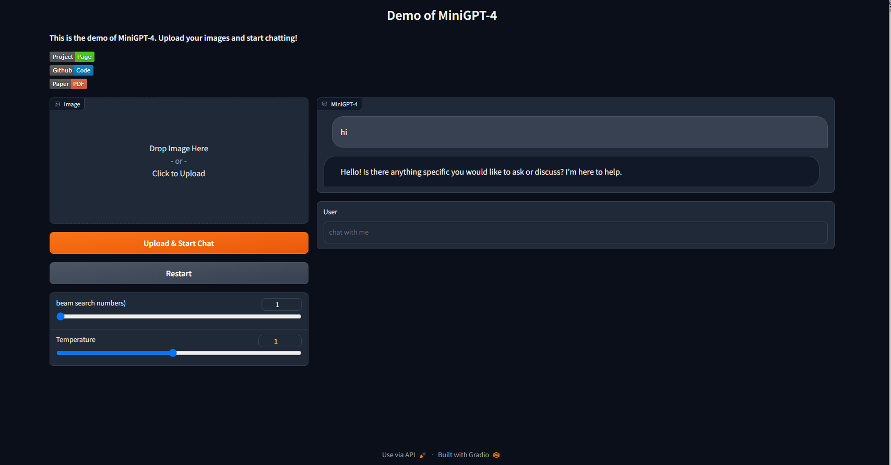

# miniGPT4 
[Chineses version](README_cn.md) <p>🚀🚀</p> 
This project has modified demo.py and conversation.py to support direct text conversation without the need to upload an image first.

**TODO: Support multiple images uploading.**

exmple：


The following is the process for configuring the project environment. If you have already completed this step, you can skip the environment configuration and directly run demo.py.

[Offcial repo](https://github.com/Vision-CAIR/MiniGPT-4)
supports two pretrained weights [13B](https://drive.google.com/file/d/1a4zLvaiDBr-36pasffmgpvH5P7CKmpze/view) and [7B](https://drive.google.com/file/d/1a4zLvaiDBr-36pasffmgpvH5P7CKmpze/view) can be used fintuning 

**GPU Memory needed** 

* 13B： 23G
* 7B: 11.5G

### Getting start
**0.Environment setup**

make sure you install docker first

pull up [docker image](https://hub.docker.com/r/bewithmeallmylife/mini-gpt4-runtime-cuda-10.2)
```commandline
docker pull bewithmeallmylife/mini-gpt4-runtime-cuda-10.2:1.0.0
```
Build the container, expose the corresponding port to enable launching the frontend UI for local use.
```commandline
docker run -v /data:/projects -v /data2:/data2 -p 1118:7778 --shm-size 8G --name minigpt4 -d bewithmeallmylife/mini-gpt4-runtime-cuda-10.2:1.0.0 tail -f /dev/null
```
Get into docker
```commandline
docker exec -it minigpt4 bash
```
conda environment **mini-gpt4** already have
```commandline
conda activate mini-gpt4
```
note: make sure torch is compatible with your cuda version, in this image, the torch version is 1.12.1+cu10.2
if your cuda is above 11, then execute this step.

The inference environment required for miniGPT4 is already included in the image, with PyTorch version 1.12.1+cu10.2, which does not support the sm86 architecture. If the GPU model is RTX A6000 with an architecture of 8.6, a version that supports this architecture such as torch1.12.1+cu11.3 needs to be reinstalled.
```commandline
conda install pytorch==1.12.1 torchvision==0.13.1 torchaudio==0.12.1 cudatoolkit=11.3 -c pytorch
```

**1.Prepare the pretrained model weights.**

A total of three pretrained model weights need to be prepared: **vicuna** (7B/14G), **llama** (7B/12.5G), and **miniGPT4** (7B).
* vicuna

Pretrained weights in two sizes, 13B and 7B, are available for download.
```commandline
git lfs install
git clone https://huggingface.co/lmsys/vicuna-13b-delta-v0  # more powerful, need at least 24G gpu memory
# or
git clone https://huggingface.co/lmsys/vicuna-7b-delta-v0  # smaller, need 12G gpu memory
```
These two weights are not working, we still need llama pretrained wieght.
* llama

To download the llama weights, which are not officially available for download, a third-party download form is used. Choose between 7B or 13B.
```commandline
wget https://agi.gpt4.org/llama/LLaMA/tokenizer.model -O ./tokenizer.model
wget https://agi.gpt4.org/llama/LLaMA/tokenizer_checklist.chk -O ./tokenizer_checklist.chk
wget https://agi.gpt4.org/llama/LLaMA/7B/consolidated.00.pth -O ./7B/consolidated.00.pth
wget https://agi.gpt4.org/llama/LLaMA/7B/params.json -O ./7B/params.json
wget https://agi.gpt4.org/llama/LLaMA/7B/checklist.chk -O ./7B/checklist.chk
wget https://agi.gpt4.org/llama/LLaMA/13B/consolidated.00.pth -O ./13B/consolidated.00.pth
wget https://agi.gpt4.org/llama/LLaMA/13B/consolidated.01.pth -O ./13B/consolidated.01.pth
wget https://agi.gpt4.org/llama/LLaMA/13B/params.json -O ./13B/params.json
wget https://agi.gpt4.org/llama/LLaMA/13B/checklist.chk -O ./13B/checklist.chk
```
After downloading llama, we need to transform it to Huggingface format
```commandline
git clone https://github.com/huggingface/transformers.git
python transformers/src/transformers/models/llama/convert_llama_weights_to_hf.py \
    --input_dir /path/to/downloaded/llama/weights --model_size 7B --output_dir /output/path/to/llama-13bOR7b-hf/
```
After both the vicuna and llama weights are prepared, they need to be combined to obtain the vicuna weights that can be used.
```commandline
pip install git+https://github.com/lm-sys/FastChat.git@v0.1.10
python -m fastchat.model.apply_delta --base /path/to/llama-13bOR7b-hf/  --target /path/to/save/working/vicuna/weight/  --delta /path/to/vicuna-13bOR7b-delta-v0/
```
Finally get a working weight, the weight folder is like below：
```commandline
vicuna_weights
├── config.json
├── generation_config.json
├── pytorch_model.bin.index.json
├── pytorch_model-00001-of-00003.bin
...   
```
Then, set the path to the vicuna weight in the model config file [here](minigpt4/configs/models/minigpt4.yaml) at Line 16.
* minigpt4 checkpoints

[13B checkpoint](https://drive.google.com/file/d/1a4zLvaiDBr-36pasffmgpvH5P7CKmpze/view?usp=share_link)
[7B checkpoint](https://drive.google.com/file/d/1RY9jV0dyqLX-o38LrumkKRh6Jtaop58R/view?usp=sharing)

Then, set the path to the pretrained checkpoint in the evaluation config file in [eval_configs/minigpt4_eval.yaml](eval_configs/minigpt4_eval.yaml) at Line 11.


**2.run demo.py**
```commandline
python demo.py --cfg-path eval_configs/minigpt4_eval.yaml  --gpu-id 0
```
